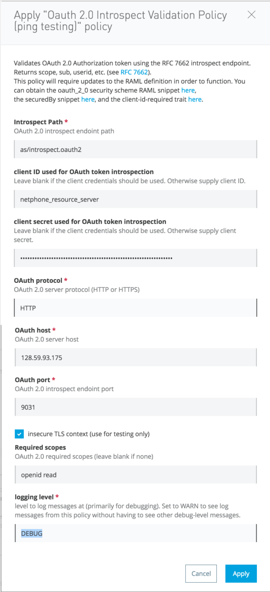

# OAuth 2.0 Access Token Introspection Policy
## Introduction
This Mulesoft API Gateway custom policy is a replacement for the Mulesoft Anypoint Platform API Manager's "out-of-the-box"
[OAuth 2.0 Access Token Enforcement Using External Provider Policy](https://docs.mulesoft.com/api-manager/external-oauth-2.0-token-validation-policy).
Rather than Mulesoft's (undocumented) approach for token validation, this policy uses the [RFC 7662](https://tools.ietf.org/html/rfc7662)
introspect endpoint to both validate the Access Token and return the valid scopes and other RFC 7662 response values
for use downstream in the API implementation.

(There's also an [OpenAM OAuth Token Enforcement Policy](https://docs.mulesoft.com/api-manager/openam-oauth-token-enforcement-policy)
and a [PingFederate OAuth Token Enforcement Policy](https://docs.mulesoft.com/api-manager/pingfederate-oauth-token-enforcement-policy) that apparently
are tied to identity federation with Mulesoft Anypoint Platform. While not yet able to test that
policy, it appears likely that it does not use the RFC 7662 introspection approach and more likely uses the userinfo, tokeninfo or other endpoints.)

## API Developer Notes
### Which Client Credential?
Some _introspect_ implementations require (or support, based on configuration), use of the same
client credentials that were used to obtain an access token to introspect it while others use a
different (e.g. Resource Server's) client credentials. As such, this policy will either use
the configured credentials, or, if none are configured, use those passed along in the API call.

### Required Headers and Query Parameters
This policy requires API consumers to supply:
 - Authorization: "Bearer *access_token*" header
 - query parameters of client\_id=*id* and client\_secret=*secret*

### OAuth 2.0 and client-id-required RAML 
API developers that use this policy should add the appropriate OAuth 2.0 Security Scheme and client-id-required Trait
[RAML snippets](https://github.com/raml-org/raml-spec/blob/master/versions/raml-08/raml-08.md#resource-types-and-traits)
to document these requirements.

### Downstream Mule FlowVars and HTTP Headers (inboundProperties)

On successful token introspection and validation, this policy adds the following headers to the flow based
on the keys in the introspection [RFC 7662](https://tools.ietf.org/html/rfc7662#page-6) JSON response:

**HTTP Headers (inboundProperties):**

- X-AGW-active
- X-AGW-client_id
- X-AGW-exp
- X-AGW-iss
- X-AGW-scope
- X-AGW-sub
- X-AGW-token_type
- X-AGW-user_id
- X-AGW-userid (added for compatibility with documented Mulesoft OpenAM and PingFederate policies)

**FlowVars:**

- \_agwTokenContext: JSON string representation of RFC 7662 response returned by introspect endpoint.
- \_agwHashMap: java.util.HashMap version of the same.
- \_client_id: XXX TODO?
- \_client_name: XXX TODO?

## Applying the Policy

Apply the policy the usual way in API Manager. For now, fill in the host, port and URI path separately
(TBD: handle URI as one parameter), as well as the list of required scopes.

## Policy Developer Notes
The following are further notes for developers of this Policy.

### Installing the Policy

Follow the Mulesoft instructions for adding custom policies, uploading the YAML and XML files.

### OpenAM as an OAuth 2.0 server with the RFC 7662 introspect endpoint
OpenAM endpoints are documented [here](https://backstage.forgerock.com/#!/docs/openam/13.5/dev-guide#rest-api-oauth2-client-endpoints)

The introspect endpoint requires the following:
 - method POST
 - header Authorization: Basic *HTTPBasicAuth(client\_id,client\_secret)*
 - parameter token=*access\_token*

### PingFederate as an OAuth 2.0 server with the RFC 7662 introspect endpoint
PingFederate endpoints are documented [here](https://documentation.pingidentity.com/pingfederate/pf82/index.shtml#adminGuide/concept/oAuth2_0Endpoints.html)

The introspect endpoint requires the following:
 - method POST
 - header Authorization: Basic *HTTPBasicAuth(client\_id,client\_secret)*
 - parameter token=*access\_token*

### Developing and Testing Mulesoft Custom Policies in Anypoint Studio
See https://docs.mulesoft.com/anypoint-studio/v/6/studio-policy-editor and
https://docs.mulesoft.com/api-manager/creating-a-policy-walkthrough

Since we also use Anypoint Studio to test policies pushed from the Anypoint API Manager, there
can be some confusion about the API Autodiscovery mechanism and whether we are testing
our locally-developed policy (a beta feature of Studio 6.1) or one pushed down from API Manager.
There's nothing in the configuration that says which one to use, but it actually just works
as expected when you right-click on the policy and select Run As/API Custom Policy (configure):

")

### Inconsistency across Mule implementations of OAuth 2.0

Mule has three documented implementations of OAuth 2.0 token validation and there are inconsistencies
with how the result of a successful validation is made available to the downstream API app:

- The [external OAuth 2.0 token validation policy](https://docs.mulesoft.com/api-manager/external-oauth-2.0-token-validation-policy#obtaining-user-credentials)
  identifies the user as `_muleEvent.session.securityContext.authentication.principal.username` and suggests putting this in an X-Authenticated-Userid header
- The [OpenAM OAuth Token Enforcement policy](https://docs.mulesoft.com/api-manager/openam-oauth-token-enforcement-policy#obtaining-user-credentials)
  identifies the user as one of the following inboundProperties (HTTP headers) or flow variables:
  - X-AGW-userid for authorization code grant type, or
  - X-AGW-client_id for client credentials grant type
  - flowVars[\_agwUser] HashMap which includes uid, group and email keys.
- The [PingFederate OAuth Token Enforcement policy](https://docs.mulesoft.com/api-manager/pingfederate-oauth-token-enforcement-policy#obtaining-user-credentials)
  similarly to OpenAM uses the same values.

So, I conclude that the new “standard” is what’s used for OpenAM and PingFederate.

**Additional observed flowVars:**

https://docs.mulesoft.com/release-notes/api-gateway-2.0.2-release-notes documents `flowVars[_agwTokenContext]` 
which on inspection is a String containing the returned JSON map.

I've also seen these flowVars inbound:
- \_client\_id
- \_client\_name

### CAVEATS
- **Consider this an Alpha test experimental version!**
- This policy has been tested only with OpenAM 14.0 and PingFederate 8.2.2, so might not work with other RFC 7662 implementations.
- Two distinct, independent sets of client credentials (client\_id and client\_secret) are used:
  - OAuth 2.0 client credentials used with the Oauth 2.0 server.
  - Client credentials registered with the Mulesoft Anypoint Plaform which are used to implement SLAs, app usage tracking, etc.
  To avoid confusion, the Anypoint Platform credentials are used to create OpenAM/PingFederate credentials so that they match. But, this is
  not a requirement. I'm assuming that once integrated with MuleSoft's API Platform, the credentials are synced up by MuleSoft
  call OpenAM/PingFederate APIs.
  - As noted above, there can be two sets of client credentials: Those used by the client app to get the access token and those
  used by the resource server to introspect that access token. Which credential is the "right one" is configurable in the OAuth server.
- Credential caching is not done, so heavy API use will result in heavy load on the OAuth 2.0 introspection endpoint.

### TO DO
- Remove client credentials so they don't flow downstream to the app.
- Clean up intermediate flowVars so they don't flow downstream to the app.
- Add TTL-based caching with [object store connector](https://docs.mulesoft.com/mule-user-guide/v/3.8/object-store-connector).

## Author
Alan Crosswell

Copyright (c) 2016 The Trustees of Columbia University in the City of New York

