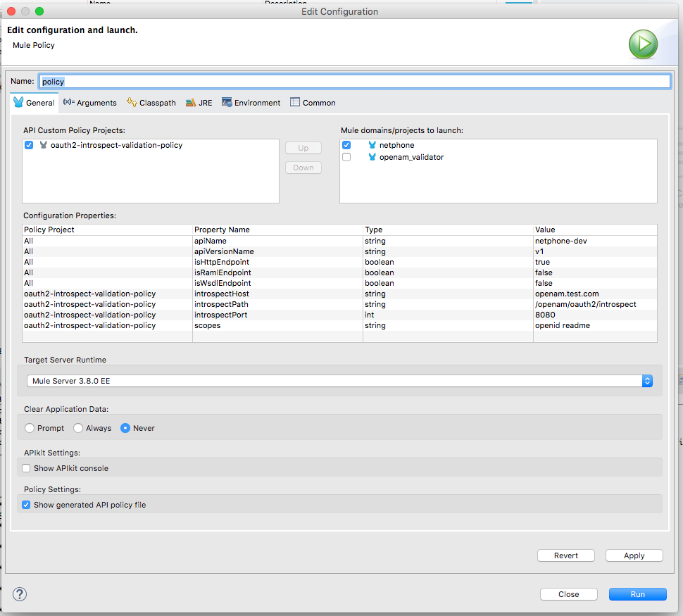

# OAuth 2.0 Access Token Introspection Policy
## Introduction
This custom policy is a replacement for the Mulesoft EE API Manager "out-of-the-box"
[OAuth 2.0 Access Token Enforcement Using External Provider Policy](https://docs.mulesoft.com/api-manager/external-oauth-2.0-token-validation-policy).
Rather than Mulesoft's (undocumented) approach for token validation, this policy uses the [RFC 7662](https://tools.ietf.org/html/rfc7662)
introspect endpoint to both validate the Access Token and return the valid scopes and other RFC 7662 response values
for use downstream in the API implementation.

(There's also an [OpenAM OAuth Token Enforcement Policy](https://docs.mulesoft.com/api-manager/openam-oauth-token-enforcement-policy) that we currently
lack access to (due to some crazy licensing entitlement issues with respect to federated identity management). While not able to test that
policy, it appears likely that it does not use the RFC 7662 introspection approach and more likely uses the userinfo or tokeninfo endpoints.)

## API Developer Notes
### Required Headers and Query Parameters
This policy requires API consumers to supply:
 - Authorization: "Bearer *access_token*" header
 - query parameters of client\_id=*id* and client\_secret=*secret*

**N.B.** Whereas the Mulesoft OAuth 2.0 Access Token Enforcement policy only needs the
Authorization Token in order to validate it, this policy additionally requires the Client ID and
Secret, since OpenAM will only respond to an introspect that has been validated with Basic Auth
using them. This is not such a big deal since, if one is client registration-requiring policies (such as throttling
or rate-liming SLAs), then consumer apps must register to use the API and provide their client\_id and client\_secret.

### OAuth 2.0 and client-id-required RAML 
API developers that use this policy should add the appropriate OAuth 2.0 Security Scheme and client-id-required Trait
[RAML snippets](https://github.com/raml-org/raml-spec/blob/master/versions/raml-08/raml-08.md#resource-types-and-traits)
to document these requirements.

### Downstream Mule FlowVars and HTTP Headers (inboundProperties)

On successful token introspection and validation, this policy adds the following headers to the flow based
on the keys in the introspection [RFC 7662](https://tools.ietf.org/html/rfc7662#page-6) JSON response:

**HTTP Headers (inboundProperties):**

- X-AGW-active
- X-AGW-client_id
- X-AGW-exp
- X-AGW-introspect XXX json map returned by introspect endpoint (replace with _agwTokenContext flowVar)
- X-AGW-iss
- X-AGW-scope
- X-AGW-sub
- X-AGW-token_type
- X-AGW-user_id
- X-AGW-userid XXX TODO
- etc. TBD upon further experimentation.

**FlowVars:**

- \_agwTokenContext: XXX TODO: String RFC 7662 JSON returned by introspect endpoint. (supplement with userid?)
- \_agwHashMap: XXX TODO: HashMap version of the same.
- \_client_id: XXX TODO:
- \_client_name: XXX TODO:

## Policy Developer Notes
The following are further notes for developers of this Policy.

### OpenAM as an OAuth 2.0 server with the RFC 7662 introspect endpoint
OpenAM endpoints are documented here:
https://backstage.forgerock.com/#!/docs/openam/13.5/dev-guide#rest-api-oauth2-client-endpoints

The introspect endpoint requires the following:
 - method POST
 - header Authorization: Basic *HTTPBasicAuth(client\_id,client\_secret)*
 - parameter token=*access\_token*

### Developing and Testing Mulesoft Custom Policies in Anypoint Studio
See https://docs.mulesoft.com/anypoint-studio/v/6/studio-policy-editor and
https://docs.mulesoft.com/api-manager/creating-a-policy-walkthrough

Since we also use Anypoint Studio to test policies pushed from the Anypoint API Manager, there
can be some confusion about the API Autodiscovery mechanism and whether we are testing
our locally-developed policy (a beta feature of Studio 6.1) or one pushed down from API Manager.
There's nothing in the configuration that says which one to use, but it actually just works
as expected when you right-click on the policy and select Run As/API Custom Policy (configure):

")

### Inconsistency across Mule implementations of OAuth 2.0

Mule has three documented implementations of OAuth 2.0 token validation and there are inconsistencies
with how the result of a successful validation is made available to the downstream API app:

- The [external OAuth 2.0 token validation policy](https://docs.mulesoft.com/api-manager/external-oauth-2.0-token-validation-policy#obtaining-user-credentials)
  identifies the user as `_muleEvent.session.securityContext.authentication.principal.username` and suggests putting this in an X-Authenticated-Userid header
- The [OpenAM OAuth Token Enforcement policy](https://docs.mulesoft.com/api-manager/openam-oauth-token-enforcement-policy#obtaining-user-credentials)
  identifies the user as one of the following inboundProperties (HTTP headers) or flow variables:
  - X-AGW-userid for authorization code grant type, or
  - X-AGW-client_id for client credentials grant type
  - flowVars[\_agwUser] HashMap which includes uid, group and email keys.
- The [PingFederate OAuth Token Enforcement policy](https://docs.mulesoft.com/api-manager/pingfederate-oauth-token-enforcement-policy#obtaining-user-credentials)
  similarly to OpenAM uses the same values.

So, I conclude that the new “standard” is what’s used for OpenAM and PingFederate.

**Additional observed flowVars:**

https://docs.mulesoft.com/release-notes/api-gateway-2.0.2-release-notes documents `flowVars[\_agwTokenContext]` 
which on inspection is a String containing the returned JSON map.

I've also seen these flowVars inbound:
- \_client\_id
- \_client\_name

### Caveats
- This policy has been tested only with OpenAM 14.0, so might not work with other RFC 7662 implementations.
- It has not yet been tested with an HTTPS endpoint (and needs to be fixed to use HTTPS).
- Consider this an Alpha test version!

### Author
Alan Crosswell

Copyright (c) 2016 The Trustees of Columbia University in the City of New York

